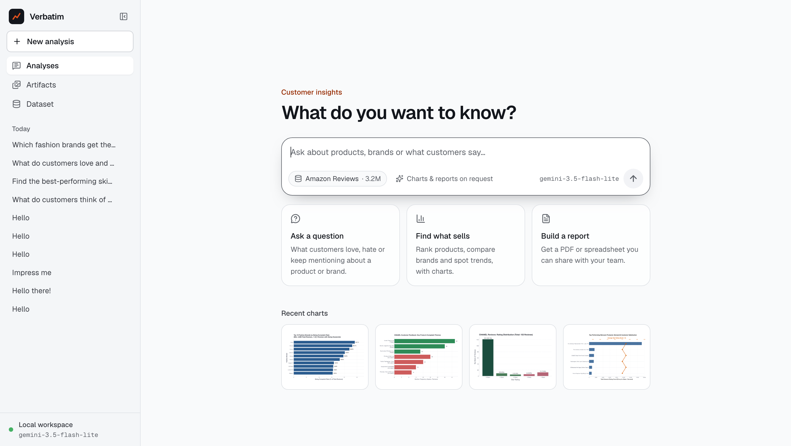
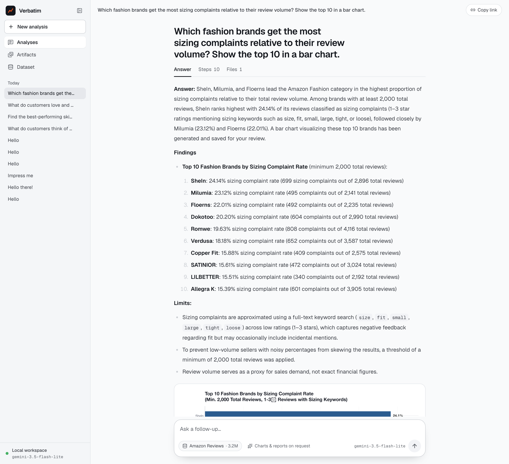
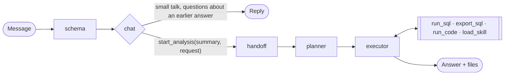
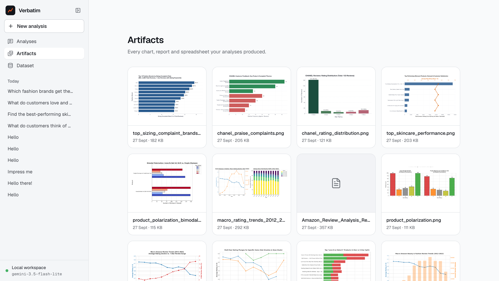
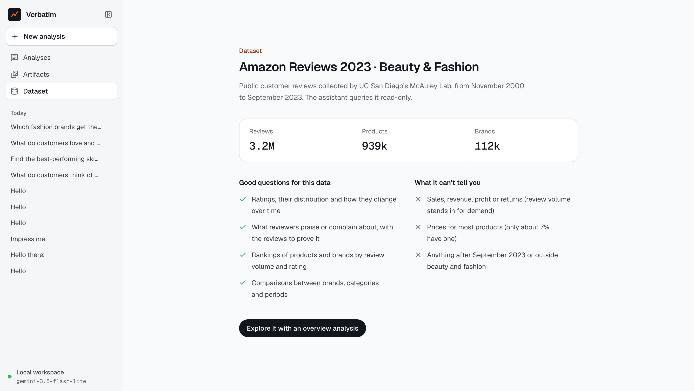

# Verbatim

An agent that answers business questions over 3.2 million Amazon reviews. It plans the analysis, queries
Postgres, reads reviews, runs Python for charts and reports, and cites the reviews behind every claim.





## How a question flows through it



1. `schema` doesn't call a model at all. It reads the database catalog once (tables, column comments,
   foreign keys, common values from `pg_stats`), adds a few hand-written notes about quirks in the data, and
   caches the result for the prompts that need it. I started with a recon agent here and dropped it: the
   schema never changes, so paying a model to rediscover it every turn made no sense.
2. `chat` is the only node that sees the whole conversation. Small talk gets a direct reply. Anything that
   needs data becomes a `start_analysis` call with a summary of the conversation and a standalone version of
   the request, so "now do the same for Gucci" reaches the planner as a complete question.
3. `handoff` validates the tool arguments, answers the tool call and marks where the new run starts.
4. `planner` returns a plan validated with Pydantic: the objective, the assumptions behind it and the steps.
   The assumptions matter more than I expected. The data has no sales figures, so "best selling" has to be
   approximated somehow, and the plan has to say how. The UI shows it as a card.
5. `executor` is a tool loop. It gets the conversation summary and this run's tool traffic, nothing from
   earlier runs, which keeps its context from filling up over a long session.

### Tools and skills

- `run_sql` queries through a read-only Postgres role that also has a statement timeout. Results come back
  as a markdown table, capped at 200 rows, with long text cut short.
- `export_sql` streams a query result to CSV so code in the sandbox can use it without the rows passing
  through the model.
- `run_code` runs Python or JavaScript inside
  [sandbox-runtime](https://github.com/anthropic-experimental/sandbox-runtime), which uses `sandbox-exec` on
  macOS and bubblewrap on Linux. Code can write only to `workspace/`, has no network access, and can't read
  `.env`. Anything saved to `workspace/outputs/` shows up in the UI. A matplotlib style is preloaded so charts
  match the app.
- `load_skill` returns the instructions in `skills/<name>/SKILL.md`. Prompts only carry each skill's name and
  description, and the full text loads when the executor needs it.

### The UI

`web/` is a Vite and React app that talks to the LangGraph Agent Server through `useStream`. Each answer has
Answer, Steps and Files tabs. The review ids the agent cites become source cards and hover previews, charts
show up inline, and any file opens in a side panel. There are also pages for past analyses, every artifact
produced so far, and the dataset.

| Artifacts | Dataset |
| --- | --- |
|  |  |

### Metrics

Every model call logs its input tokens and what share of the context window they take, so I can watch the
context grow during a run without opening a tracing tool. The CLI also appends a summary of each run to
`logs/runs.jsonl`.

## Things I learned along the way

- Free tiers break multi-step agents before anything else does. Groq caps a request at 7k input tokens per
  minute and the executor's prompt alone is about 5k, so a run dies after two tool calls. Gemini 3.8 Flash
  gives you 20 requests a day, which isn't even one analysis. It runs on Gemini 3.5 Flash-Lite for now. How
  much that costs in answer quality is exactly what the evals in the TODO are for.
- Gemini rejects requests that end with a model turn, which Groq accepted without complaint. Only sending the
  executor its own tool traffic fixed it.
- A dev server that reloads on `.py` changes will restart itself mid-run if the sandbox writes its scripts
  inside the project, so they go to the system temp directory.
- Streaming UIs flicker when a message can change sections halfway through. Here each message is assigned a
  place (plan, steps or answer) from its first words, and steps are keyed by tool call id.

## Running it

You need Postgres 15 or newer, [uv](https://docs.astral.sh/uv/), Node 20+ with pnpm, and about 2 GB of disk
for the data.

```bash
./scripts/setup.sh        # Python deps, sandbox runtime and venv, web app; creates .env
```

Fill in `.env`: a [Google AI Studio](https://aistudio.google.com/apikey) key, and a password for the read-only
role (the same one in `VERBATIM_RO_PASSWORD` and `DATABASE_URL_RO`). Then:

```bash
./scripts/load-data.sh    # downloads ~620 MB, loads Postgres (~15 min), creates the read-only role
./scripts/dev.sh          # API on :2024, web app on http://localhost:3001
```

There's also a terminal version: `uv run python -m agent` for a session, or
`uv run python -m agent "your question"` for a one-off answer.

### Tests and checks

```bash
uv run ruff check . && uv run ruff format --check .
uvx pyright
uv run pytest                        # needs the database and the sandbox
uv run pytest -m "not integration"   # what CI runs
```

CI runs the lint and type checks, the tests that don't need a database, and the web build.

### Docker

The `Dockerfile` builds the API server with the sandbox runtime (bubblewrap on Linux). The database stays
outside the container:

```bash
docker build -t verbatim .
docker run --env-file .env -e DATABASE_URL_RO=postgresql://verbatim_ro:<password>@host.docker.internal:5432/reviews \
  -p 2024:2024 --security-opt seccomp=unconfined --security-opt apparmor=unconfined verbatim
```

bubblewrap needs user namespaces, and Docker's default seccomp profile blocks them, hence the two
`--security-opt` flags. I haven't run the image myself, since Docker is too heavy for my machine.

## Layout

```
agent/          graph, nodes, tools, settings, metrics, API routes
skills/         SKILL.md files loaded on demand
sandbox/        sandbox runtime, its Python packages, chart style
db/             schema, indexes, loader, read-only role
web/            the UI
scripts/        setup, data loading, dev servers
tests/
```

## TODO

- Evals. A fixed set of questions with checks on the SQL, the numbers and the citations. Without them, every
  "this prompt is better" is a guess.
- MCP integration, both ways: expose the tools over MCP, and let the agent use other MCP servers.
- A skill marketplace, so skills can be installed and shared instead of living in this repo.
- Document processing: upload your own PDFs or spreadsheets and analyse them next to the reviews.

## Data

[Amazon Reviews 2023](https://amazon-reviews-2023.github.io/) from UC San Diego's McAuley Lab, All_Beauty and
Amazon_Fashion categories.
